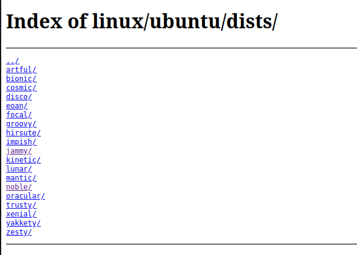
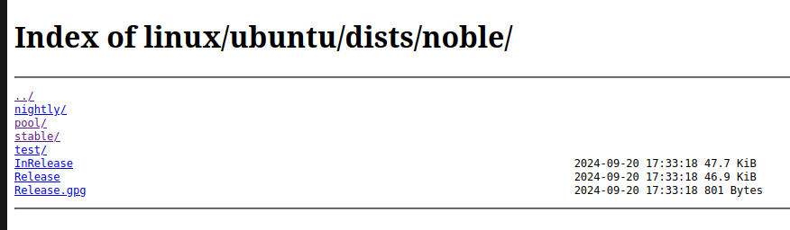
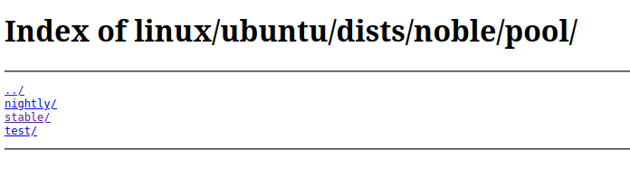
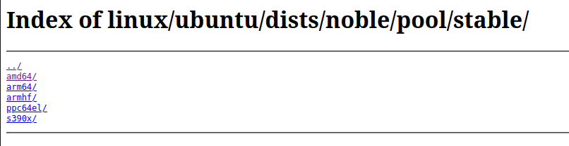
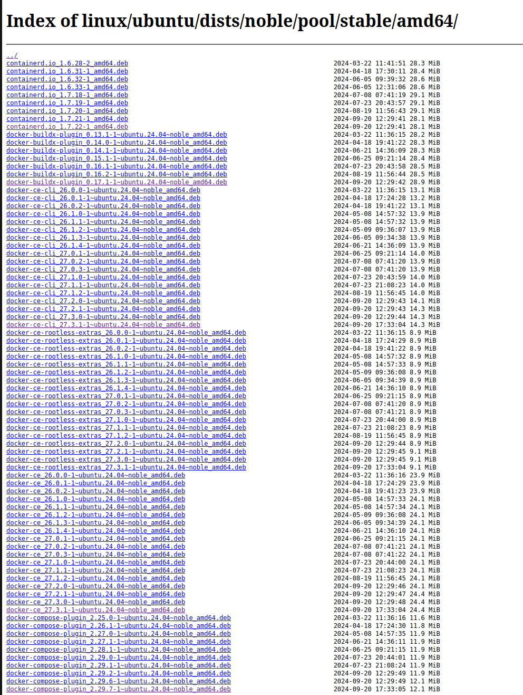
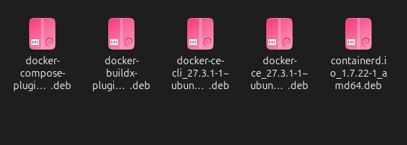

# Docker_commands

### How to install?

Follow this page   for Ubuntu https://docs.docker.com/desktop/install/linux/

First of all, check KVM Virtualization support https://docs.docker.com/desktop/install/linux/#kvm-virtualization-support

If you  are on Ubuntu, follow these
1. Run this command in the terminal

sudo apt install gnome-terminal

2. Set up Docker's apt repository and run this in the terminal

# Add Docker's official GPG key:
sudo apt-get update
sudo apt-get install ca-certificates curl
sudo install -m 0755 -d /etc/apt/keyrings
sudo curl -fsSL https://download.docker.com/linux/ubuntu/gpg -o /etc/apt/keyrings/docker.asc
sudo chmod a+r /etc/apt/keyrings/docker.asc

# Add the repository to Apt sources:
echo \
  "deb [arch=$(dpkg --print-architecture) signed-by=/etc/apt/keyrings/docker.asc] https://download.docker.com/linux/ubuntu \
  $(. /etc/os-release && echo "$VERSION_CODENAME") stable" | \
  sudo tee /etc/apt/sources.list.d/docker.list > /dev/null
sudo apt-get update

3. Follow Install from packages https://docs.docker.com/engine/install/ubuntu/#install-from-a-package

or, 
GO here https://download.docker.com/linux/ubuntu/dists/

Then check your ubuntu version by running cat /etc/*release . Now check the UBUNTU_CODENAME. For example, it's noble.

SO, now go to noble/

Then pool/

Then stable/

Then depending on  your arhitecture, choose one. I am choosing amd64/

Now from there, download the laters debian versions of  containerd.io_<version>_<arch>.deb, docker-ce_<version>_<arch>.deb, docker-ce-cli_<version>_<arch>.deb, docker-buildx-plugin_<version>_<arch>.deb, docker-compose-plugin_<version>_<arch>.deb

These are  my  dowloaded laters versions

Now modify this command with your downloaded file's name

sudo dpkg -i ./containerd.io_<version>_<arch>.deb \
  ./docker-ce_<version>_<arch>.deb \
  ./docker-ce-cli_<version>_<arch>.deb \
  ./docker-buildx-plugin_<version>_<arch>.deb \
  ./docker-compose-plugin_<version>_<arch>.deb

 and run that. For example, instead of ./containerd.io_<version>_<arch>.deb, you will have ./containerd.io_1.7.22-1_amd64.deb

Once done, verify that you have docker by using these

sudo service docker start
sudo docker run hello-world

Done!!
